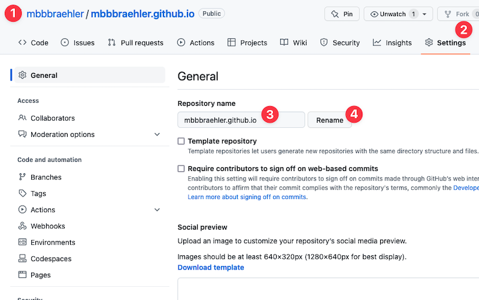
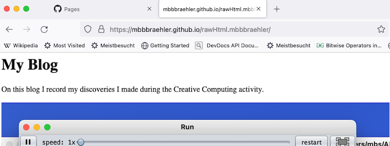

# Session 7 - GitHub Pages with Jekyll, more MAX8 with MIDI and introduction to sound synthesis with BEAP

## How are files stored on a computer?

## Save your old website and setup Jekyll with GitHub Pages
So far you have created your website using basic HTML (content) and CSS (styling). The code was saved in a file named ```index.html```, and it was saved in a repository named YourUserName.github.io. By default, GitHub will look for such a file in a repository of that name and then load it when you enter the URL ```https.YourUserName.github.io``` in your webbrowser.

Creating a website with basic HTML and CSS gives you a lot of flexibility, but it is a tedious work, therefore we go for a simpler route as of now. 

First, we will rename the repository of your website to archive it and then continue to use the Jekyll framework on a new repository of name YourUserName.github.io to create our blog. Jekyll has the advantage that you do not need to bother about formatting the content, it comes with default styling "out of the box". HTML is replaced by a simple language called Markdown. It consists of simple tags that describe the function of the content (i.e. headline, link, image, ...). For example, a HTML```<h2>title</h2>``` headline becomes ```## text``` in Markdown.

For creating a post, you will need to place each post into a separate file inside a folder called ```_posts```. There are naming rules for the file and each file starts with a so called *YAML frontmatter* containing information like the author's name, a category to search posts later and more. Afterwards you add your content, using Markdown.

Before you start I suggest that you check out an existing repository using Jekyll ([example](https://github.com/mibrs/mibrs.github.io) is the repo for this website here), check the contents of the folders and look inside the files containing the posts. You can also copy and paste content, in particular the YAML Frontmatter and then make the changes of your own post.

Let's get started.

### Step 1 - Archive your exisiting website
Just open the repository containing your website and then follow steps 1 to 4. You will save it in a new repository under a different name.



You can still access your site with the URL ```https:YourUserName.github.io/NewRepositoryName```.



### Step 2 - Create your new website
Now we generate our new website with Jekyll. Follow the instructions [here](https://docs.github.com/en/pages/quickstart) to set up your basic site.

### Step 3 - Create your first post
Next, open [this](https://docs.github.com/en/pages/setting-up-a-github-pages-site-with-jekyll/adding-content-to-your-github-pages-site-using-jekyll#about-content-in-jekyll-sites) page and scroll down to **Adding a new post to your site**. Follow the instructions until step 8. Then choose for step 9 ```Commit directly to the main branch```. You are done! Give GitHub a few seconds to update your site, then check on ```YourUserName.github.io``` to see your website and open the post.

## Some more MAX patches with MIDI

## Introduction to BEAP, and some patches


